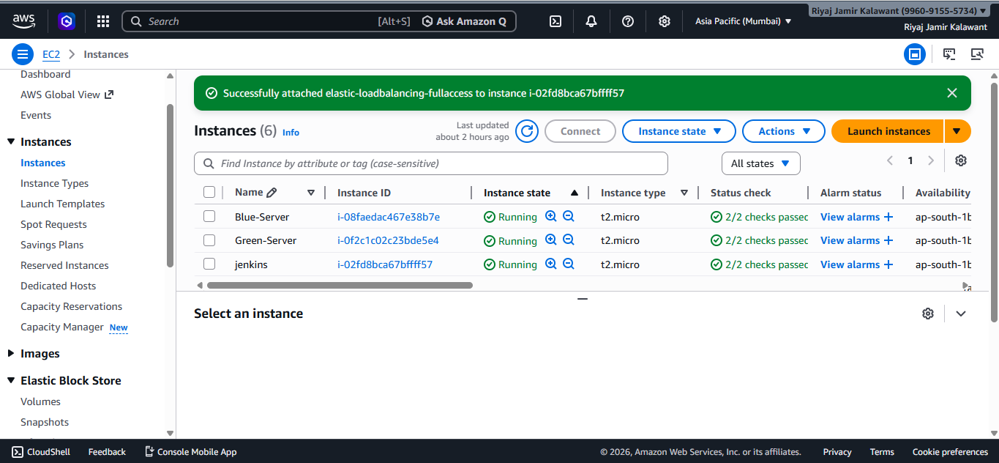
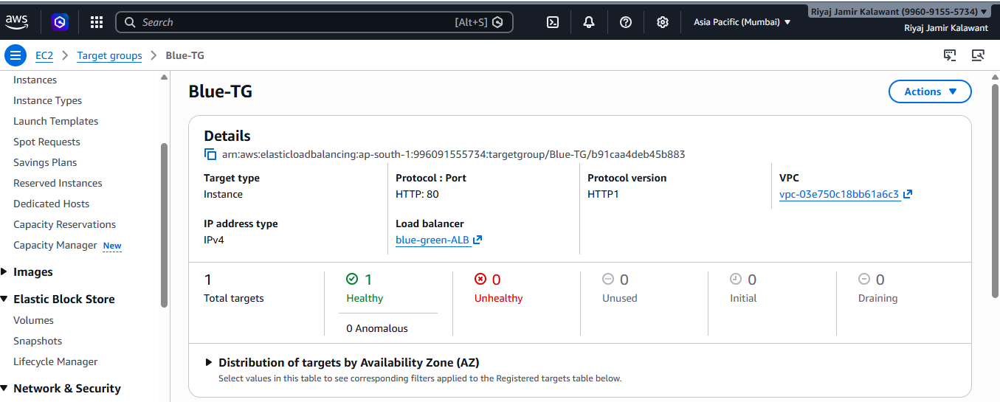
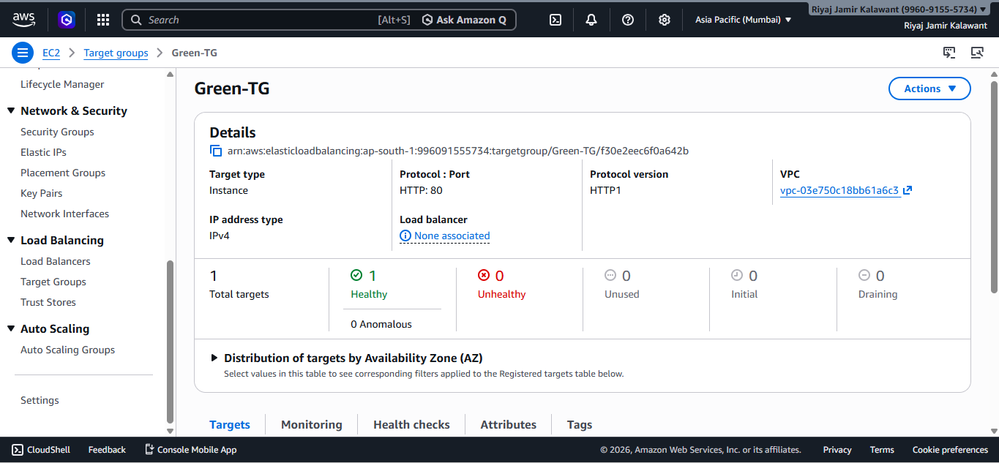
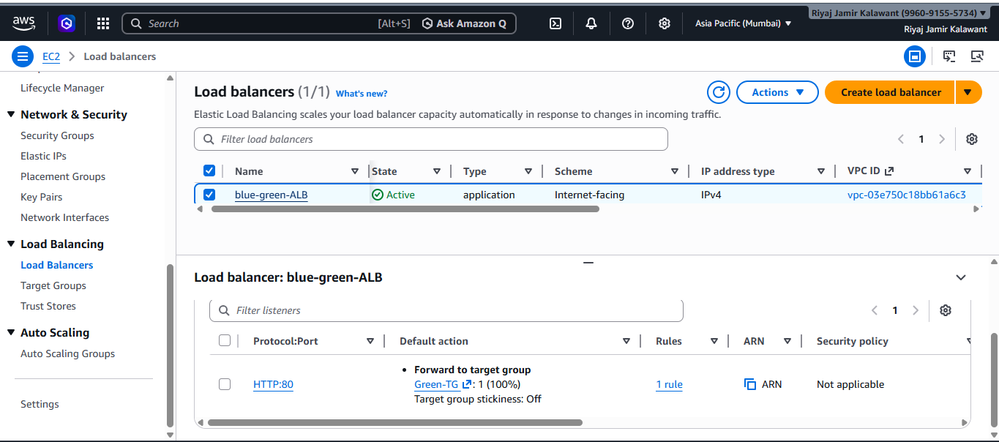
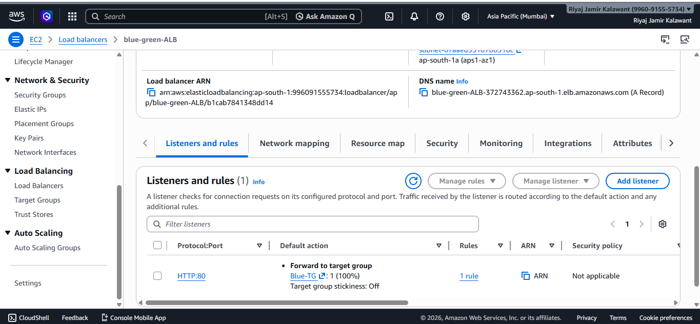
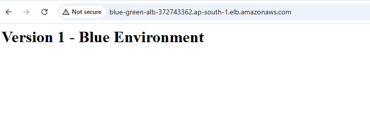
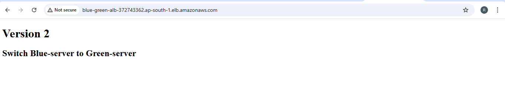
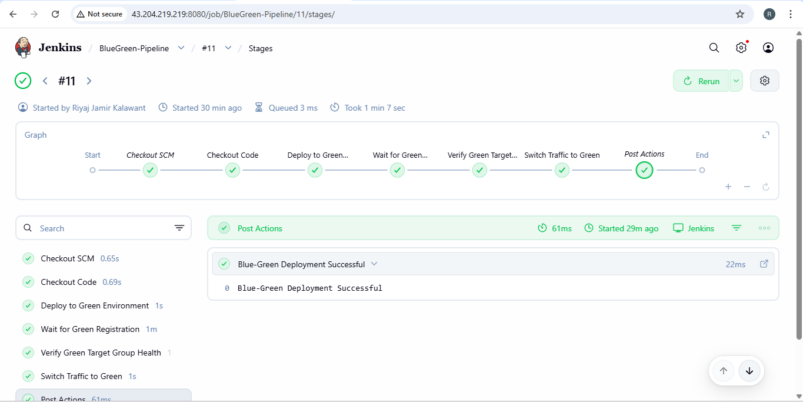
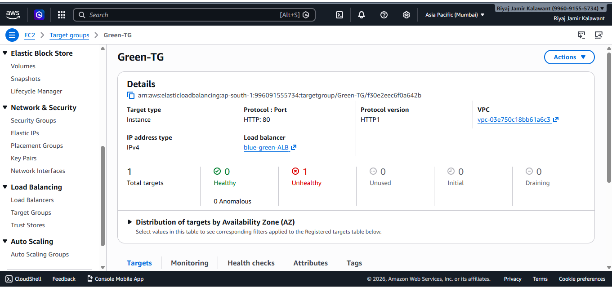
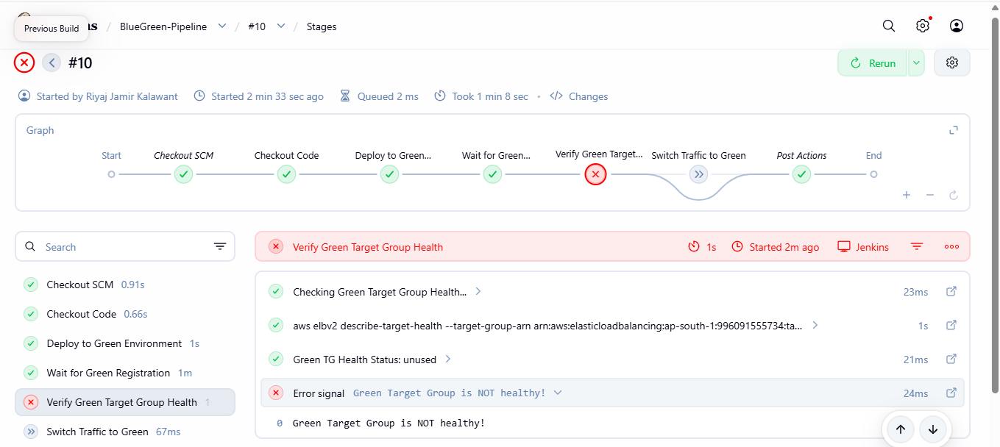

#  Production-Ready Blue-Green Deployment using Jenkins & AWS ALB

##  Project Overview

This project demonstrates a production-ready Blue-Green Deployment strategy using:

- Jenkins CI/CD
- AWS EC2
- Application Load Balancer (ALB)
- Target Groups
- Nginx
- Automatic Rollback Mechanism

The goal is to achieve zero-downtime deployments with instant rollback capability.

---

#  Infrastructure Setup

##  EC2 Instances Running

Three servers are running:

- Jenkins Server
- Blue Environment Server
- Green Environment Server

---

#  Target Group Health Status

Both Blue and Green environments remain healthy.

Blue-TG → Healthy 

Green-TG → Healthy  

 

This ensures instant rollback capability.

---

#  ALB Traffic Routing

##  Traffic Forwarded to Green

Listener → Forward to Green Target Group

---

##  Traffic Forwarded to Blue

Listener → Forward to Green Target Group

---

#  Application Output

##  Blue Environment Output

##  Green Environment Output

---

#  Jenkins Pipeline Execution

##  Successful Deployment (Healthy)

- Green deployment successful
- Target group health verified
- Traffic switched to Green

---

#  Automatic Rollback Demonstration

Green-TG → Unhealthy  

---

If Green fails health check:

- Jenkins detects failure
- Traffic automatically switches back to Blue
- Zero downtime maintained

##  Pipeline Failure (Unhealthy Green)

##  Listener Forwarded Back to Blue

Listener → Forward to Blue Target Group

---

#  Deployment Flow

1. Code Checkout from GitHub
2. Deploy to Green Server
3. Wait for Target Registration
4. Verify Target Group Health
5. Switch Traffic to Green
6. Automatic Rollback on Failure

---

#  IAM Permissions Used

Jenkins requires:

- elasticloadbalancing:DescribeTargetHealth
- elasticloadbalancing:ModifyListener

---

#  Key Features

✔ Zero Downtime Deployment  
✔ Automated Health Check Validation  
✔ Instant Rollback  
✔ High Availability  
✔ Production-Ready CI/CD Pipeline  

---

#  Interview Explanation

In this architecture:

- Both Blue and Green environments remain healthy.
- Traffic switching is handled at ALB level.
- Rollback is automatic if health checks fail.
- This ensures high availability and reliability in production systems.

---

#  Conclusion

This project successfully demonstrates a real-world DevOps Blue-Green Deployment strategy using Jenkins and AWS infrastructure.

It guarantees:

- Continuous Delivery
- Safe Deployments
- Instant Rollback
- High Reliability

---

 ### Author
 ## Riyaj Jamir Kalawant